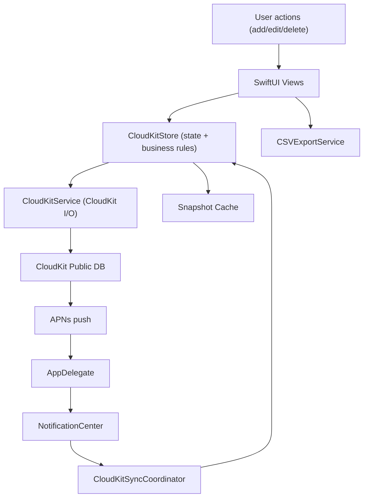

# Visual Tracker App

[](https://developer.apple.com/macos/)
[](https://developer.apple.com/xcode/swiftui/)
[](https://developer.apple.com/icloud/cloudkit/)
[](#csv-import--export)

Visual Tracker App is a macOS mentor dashboard for tracking student progress across success criteria and milestones, with CloudKit sync, sheet-based cohort segmentation, CSV workflows, and offline snapshot resilience.

## Table of Contents

- [What It Does](#what-it-does)
- [Feature Set](#feature-set)
- [Architecture](#architecture)
- [Diagrams](#diagrams)
- [Requirements](#requirements)
- [CloudKit Setup (First-Time)](#cloudkit-setup-first-time)
- [Run the App](#run-the-app)
- [CSV Import \& Export](#csv-import--export)
- [Migration Playbook (Another Mentor)](#migration-playbook-another-mentor)
- [Maintainer File Map (What to Edit)](#maintainer-file-map-what-to-edit)
- [Relevant Directory](#relevant-directory)

## What It Does

- Tracks students and their progress by success criteria and milestones.
- Organizes data by **Sheets** (each sheet maps to its own CloudKit cohort scope).
- Supports team-friendly data operations: import students, export full CSV bundles, refresh, and reset.

## Feature Set

### 1) Sheet Management

- Create, rename, switch, and delete sheets.
- Each sheet has isolated data (students, groups, expertise checks, criteria, milestones, progress).
- Main files:
  - `Visual Tracker App/Views/ManageSheetsSheet.swift`
  - `Visual Tracker App/Services/CloudKitStore.swift`

### 2) Student Management

- Add a single student via form.
- Mass-import students from CSV.
- Edit, rename, delete students.
- Assign multiple groups, learning session, expertise check, and custom properties.
- Main files:
  - `Visual Tracker App/Views/ManageStudentsSheet.swift`
  - `Visual Tracker App/Views/AddStudentSheet.swift`
  - `Visual Tracker App/Services/CloudKitStore.swift`

### 3) Group and Expertise Check Management

- Create, rename, delete groups.
- Create, rename, delete expertise checks.
- Seeded default expertise checks: `Tech`, `Design`, `Domain Expert`.
- Main files:
  - `Visual Tracker App/Views/ManageGroupsSheet.swift`
  - `Visual Tracker App/Views/ManageDomainsSheet.swift`
  - `Visual Tracker App/Services/CloudKitStore.swift`

### 4) Success Criteria and Milestones

- Create and edit success criteria.
- Create and edit milestones under criteria.
- Reorder and archive criteria/milestones.
- Quantitative + qualitative objective support.
- Main files:
  - `Visual Tracker App/Views/ManageSuccessCriteriaSheet.swift`
  - `Visual Tracker App/Views/ManageMilestonesSheet.swift`
  - `Visual Tracker App/Models/LearningObjective.swift`
  - `Visual Tracker App/Services/LearningObjectiveCatalog.swift`

### 5) Filtering and Progress Views

- Filter by:
  - Overall
  - Ungrouped
  - Specific group
  - Specific expertise check
  - No expertise check
- Student board + detail breakdowns.
- Expertise-check modes: computed vs expert review.
- Main files:
  - `Visual Tracker App/Models/StudentFilterScope.swift`
  - `Visual Tracker App/Views/StudentDetailView.swift`
  - `Visual Tracker App/Views/StudentOverviewBoard.swift`

### 6) Data Operations

- Hard refresh from CloudKit.
- Export as ZIP of CSV files.
- Reset data while restoring base defaults.
- Undo/redo stack for local operations.
- Main files:
  - `Visual Tracker App/Views/StudentDetailView.swift`
  - `Visual Tracker App/Services/Export/CSVExportService.swift`
  - `Visual Tracker App/Services/CloudKitStore.swift`

### 7) Sync and Reliability

- CloudKit live sync with push + polling + debounce orchestration.
- Snapshot cache for stale/offline fallback.
- Read-only behavior when iCloud login is unavailable.
- Main files:
  - `Visual Tracker App/Services/CloudKitSyncCoordinator.swift`
  - `Visual Tracker App/Services/AppDelegate.swift`
  - `Visual Tracker App/Services/CloudKitStoreSnapshotCache.swift`
  - `Visual Tracker App/ContentView.swift`

## Architecture

The app follows an MVVM-style structure:

- **Model**: SwiftData data models and CloudKit-backed records.
- **View**: SwiftUI screens/sheets.
- **ViewModel/State Layer**: `CloudKitStore` acts as the central state, domain logic, and CloudKit orchestration layer.



## Diagrams

### Entity Relationship Diagram

Add your ERD image here when ready.

### Sync / Migration Tactics Diagram

You can keep using the Mermaid diagram above, or replace it with your own exported image (for example: `architecture/visual-tracker-sync-flow.png`).

## Requirements

- **macOS 26.0+** (project deployment target is 26.0).
- Apple ID signed in to iCloud on the Mac.
- iCloud Drive enabled with available storage.
- Xcode with Swift 5 toolchain support for this project.

## CloudKit Setup (First-Time)

### 1. Open the project and set signing

1. Open `Visual Tracker App.xcodeproj` in Xcode.
2. Select the app target.
3. In **Signing & Capabilities**, choose your Team.

### 2. Add iCloud capability

1. Add capability: **iCloud**.
2. Enable:
   - **CloudKit**
   - **iCloud Drive (CloudDocuments)**
3. Select your container.

For this repository, the configured container is:

- `iCloud.com.ADA.CBL`

(From `Visual Tracker App/Services/CloudKitConfig.swift` and `Visual Tracker App/Visual Tracker App.entitlements`.)

### 3. Create/Use the CBL container

If you are setting this up fresh, create/select a container with a CBL suffix in your team (for example `iCloud.<your-domain>.CBL`), then update both:

- `Visual Tracker App/Services/CloudKitConfig.swift`
- `Visual Tracker App/Visual Tracker App.entitlements`

### 4. Upload/import schema

- Go to CloudKit Dashboard for your selected container.
- Import/apply the schema from:
  - `Schema.text`

### 5. Verify and run

- Build and run once after schema setup.
- App should create/load the default `main` cohort sheet automatically.

## Run the App

```bash
open "Visual Tracker App.xcodeproj"
```

Or run from Xcode with the `Visual Tracker App` scheme.

## CSV Import & Export

### Import (Mass Student Import)

From **Manage Students -> Mass Import (CSV)**.

Required CSV headers:

- `Full Name`
- `Expertise Check`
- `Learning Session`

Session mapping:

- Contains `Morning` -> `Morning`
- Contains `Afternoon` -> `Afternoon`
- Anything else defaults to `Morning`

Expertise keyword mapping:

- Contains `Tech` -> Tech
- Contains `Design` -> Design
- Contains `Domain Expert` -> Domain Expert

### Export (Full Dataset)

From toolbar: **Export**.

Exports a ZIP containing table-style CSVs, including:

- `students.csv`
- `groups.csv`
- `student_group_memberships.csv`
- `expertise_checks.csv`
- `success_criteria.csv`
- `milestones.csv`
- `objective_progress.csv`
- `student_custom_properties.csv`
- `category_labels.csv`
- `expertise_check_objective_scores.csv`
- `sheets.csv`
- `export_metadata.csv`
- (plus rollup CSVs)

## Migration Playbook (Another Mentor)

### Option A: Continue on the same CloudKit container (full shared data)

1. Clone repo and open in Xcode.
2. Set the same Team/container permissions.
3. Build and run.
4. Data appears from the shared CloudKit container.

### Option B: Move to a new team/container (clean isolation)

1. Create a new CloudKit container (CBL naming recommended).
2. Update:
   - `Visual Tracker App/Services/CloudKitConfig.swift`
   - `Visual Tracker App/Visual Tracker App.entitlements`
3. Import `Schema.text` into the new container.
4. Build and run to initialize data.
5. Use mass student CSV import for roster migration.

### Practical handoff recommendation

- Use **Export ZIP** from source environment as migration evidence/archive.
- If starting a new container, re-import students via the mass-import format and rebuild criteria/milestones as needed.
- For exact historical CloudKit record migration across containers, use CloudKit-side migration tooling/process outside this app.

## Maintainer File Map (What to Edit)

| If you need to change... | Primary file(s) | Also check |
|---|---|---|
| App entry wiring / environment injection | `Visual Tracker App/Visual_Tracker_AppApp.swift` | `Visual Tracker App/ContentView.swift` |
| CloudKit container identifier | `Visual Tracker App/Services/CloudKitConfig.swift` | `Visual Tracker App/Visual Tracker App.entitlements` |
| Cloud schema fields/record types | `Schema.text` | `Visual Tracker App/Services/CloudKitStore.swift`, `Visual Tracker App/Services/CloudKitService.swift` |
| Core state and CRUD behavior | `Visual Tracker App/Services/CloudKitStore.swift` | all related model files under `Visual Tracker App/Models/` |
| Live sync behavior | `Visual Tracker App/Services/CloudKitSyncCoordinator.swift` | `Visual Tracker App/Services/AppDelegate.swift`, `Visual Tracker App/Services/NotificationNames.swift` |
| Offline/stale cache behavior | `Visual Tracker App/Services/CloudKitStoreSnapshotCache.swift` | `Visual Tracker App/ContentView.swift` |
| Sheet lifecycle behavior | `Visual Tracker App/Views/ManageSheetsSheet.swift` | `Visual Tracker App/Services/CloudKitStore.swift` |
| Student import workflow | `Visual Tracker App/Views/ManageStudentsSheet.swift` | `Visual Tracker App/Views/AddStudentSheet.swift`, `Visual Tracker App/Services/CloudKitStore.swift` |
| Export format or files | `Visual Tracker App/Services/Export/CSVExportService.swift` | `Visual Tracker App/Views/StudentDetailView.swift`, `Visual Tracker App/Services/CloudKitStore.swift` |
| Filter/scope behavior | `Visual Tracker App/Models/StudentFilterScope.swift` | `Visual Tracker App/Views/StudentDetailView.swift` |
| Group/domain management UI | `Visual Tracker App/Views/ManageGroupsSheet.swift`, `Visual Tracker App/Views/ManageDomainsSheet.swift` | `Visual Tracker App/Services/CloudKitStore.swift` |
| Success criteria/milestone rules | `Visual Tracker App/Views/ManageSuccessCriteriaSheet.swift`, `Visual Tracker App/Views/ManageMilestonesSheet.swift` | `Visual Tracker App/Models/LearningObjective.swift`, `Visual Tracker App/Services/LearningObjectiveCatalog.swift` |

## Relevant Directory

```text
Visual Tracker App/
├── ContentView.swift
├── Visual_Tracker_AppApp.swift
├── Visual Tracker App.entitlements
├── Models/
│   ├── Student.swift
│   ├── CohortGroup.swift
│   ├── Domain.swift
│   ├── LearningObjective.swift
│   ├── ObjectiveProgress.swift
│   ├── StudentCustomProperty.swift
│   ├── StudentGroupMembership.swift
│   ├── StudentFilterScope.swift
│   ├── CohortSheet.swift
│   └── CategoryLabel.swift
├── Services/
│   ├── CloudKitConfig.swift
│   ├── CloudKitService.swift
│   ├── CloudKitStore.swift
│   ├── CloudKitSyncCoordinator.swift
│   ├── CloudKitStoreSnapshotCache.swift
│   ├── AppDelegate.swift
│   ├── NotificationNames.swift
│   ├── LearningObjectiveCatalog.swift
│   ├── ProgressCalculator.swift
│   ├── ZoomManager.swift
│   └── Export/
│       └── CSVExportService.swift
└── Views/
    ├── StudentOverviewBoard.swift
    ├── StudentDetailView.swift
    ├── ManageSheetsSheet.swift
    ├── ManageStudentsSheet.swift
    ├── ManageGroupsSheet.swift
    ├── ManageDomainsSheet.swift
    ├── ManageSuccessCriteriaSheet.swift
    ├── ManageMilestonesSheet.swift
    ├── AddStudentSheet.swift
    ├── CategorySectionView.swift
    ├── ObjectiveTreeView.swift
    └── ProgressEditorView.swift

Top-level support files:
- Schema.text
- CloudKitNotes.md
- architecture/visual-tracker-erd.png
- architecture/visual-tracker-erd.svg
```
